# Tartalom
- [Tartalom](#tartalom)
- [Ütemezés](#ütemezés)
    - [2023.02.20-26](#2023.02.20-26)
- [Általános feladtok](#általnos-feladtok)
  - [Fejlesztési környezet](#fejlesztési-környezet)
  - [Egyéb előírások](#egyéb-előírások)
- [Bangó Alex](#bangó-alex)
- [Boros Tamás](#boros-tamás)
- [Busi Alex](#busi-alex)
- [Farkas Bence](#farkas-bence)
- [Földi Bence](#földi-bence)
- [Kazai Bence](#kazai-bence)
- [Nagy Gábor Mihály](#nagy-gábor-mihály)
- [Nagy Gergő](#nagy-gergő)
- [Pisák Dániel](#pisák-dániel)
- [Rézműves Márk](#rézműves-márk)
- [Sulyok István](#sulyok-istván)
- [Szabó Krisztián](#szabó-krisztián)
- [Szabó Levente](#szabó-levente)
- [Szilágyi Brendon Dominik](#szilágyi-brendon-dominik)

# Ütemezés
## 2023.02.20-26 környezet, adatbázis
- github saját repó létrehozás
- adatbázis tervezés
- diagram
- felöltés teszt adatokkal (tárolt eljárással)
- biztonsági mentés
- fejlesztési környezet létrehozás
## 2023.03.03-12 backend
- backend integrálása
- backend megértése és kipróbálása
- backend saját feladatra szabása
    - users aktualizlása
    - minden tábla CRUD
    - speciáis lekérdezések
    - lekérdezések  kipróbálása és dokumentálása: `document_database/projektnev.sql`

# Általános feladtok
A feladatot az alábbi előírásoknak megfelelően kell elkészíteni

## Fejlesztési környezet
- gitHub repo: 
    - kötelező
    - itt kell fejleszteni
    - a repo neve: a feladat neve
    - `RADME.md`
        - Itt kell leírni, hogy a feladatot hogy kell üzembe helyezni
    - `Technical description.md` (Műszaki leírás)
        - Le kell írni struktúráltan hogy működik a feladat, magyar nyelven.
    - `Users Guide.md` (Használati útmutató)
        - Le kell írni, képernyő képekkel hogy a produktumot hogy kell használni
    - `Presentation.ppt`  
        - Egy max 15 perces bemutató előadást támogató prozentáció
            - Mi a feladat célja
            - Meddig jutottam el
            - Mi a feljesztési környezet
                - pl. Mysql adatbázis, Vusj kliens, Nodejs Backend, github
            - Milyen az adatbázis (diagram, teszt adatok)
            - Hogy működik a backend
            - Hogy működik a kliens
            - Meddig jutott el a fejlszetés,
            - Milyen irányban kell továbbfejleszteni
        - Be kell mutatni működés közben

    - dokumentációs mappák:
        - `document_database`
            - `adatbázis modellje`: kép és fájl
            - `projektnev.sql`
                - Adatgerenerálás: tárolt eljárások, függvények
                - A backendben használt sql lekérdezések
            - biztonsági mentés
        - `server` mappa
            - Legyen egy adat szerver
            - Autentikációs szerver
            - npm csomagkezelés
        - `frontend` mappa
            - ide kerüljön a frontend, 
            - ami lehet teljesen független a szervertől
            - nem kötelező, hogy a szerver publikálja
            - npm csomagkezelés

## Egyéb előírások
- nyelvi előírások
    - Az objektumok (adatbázis, mező nevek, függvények, vátlzók stb. ) elnevezései angol nyelvűek.
    - A produktum működési felülete akármilyen nyelvű lehet.
    - Az adatbázis kódolása, a nyelvnek megfelelő legyen.

- Működési környezet
    - A produktum elég, ha a feljesztő környezetben működik, nem kell élesben telepíteni.

- Autentikáció kötelező javasolt: jwt token
    - users tábla
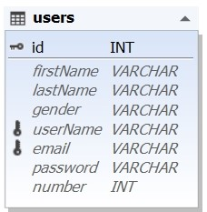
    - Regisztráció
    - Login
    - Logout
    - Jogosutsági szintek
        - adminisztrátor: teljes joggal szerkesztheti az adatokat
        - vendég: olvashatja az adatokat
        - Az oldal betöltésekor kötelező vagy regisztrálni, vagy belépni.

# Bangó Alex 
Projekt elnevezése: diakmunka
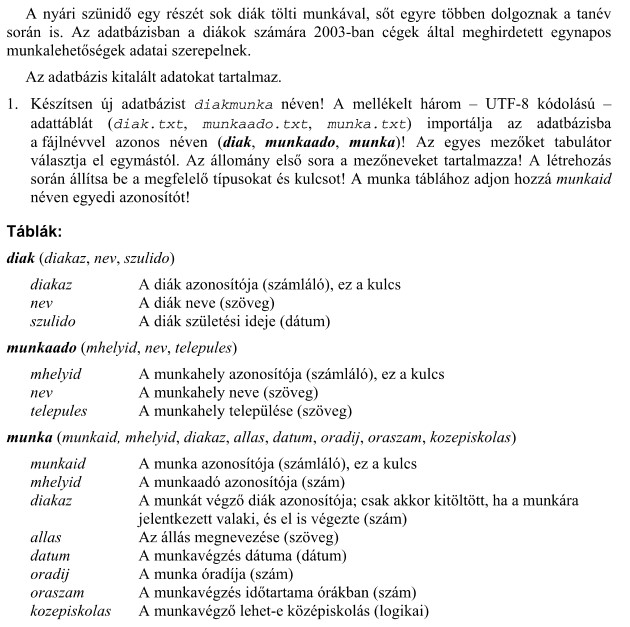

# Boros Tamás
Projekt elnevezése: webaruhazBillentyuk
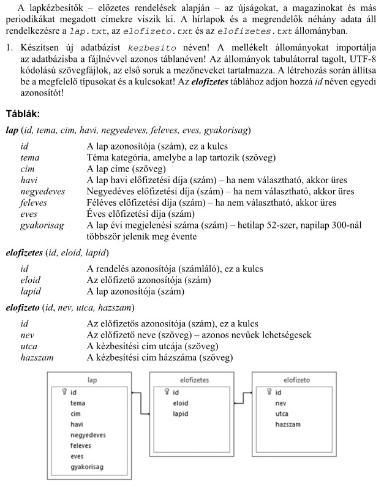

# Busi Alex
Projekt elnevezése: historia
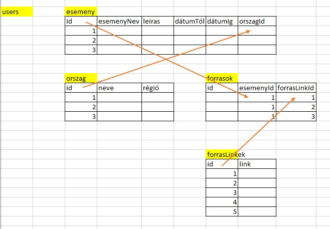

# Farkas Bence
Projekt elnevezése: webaruhazAutok

# Földi Bence
Projekt elnevezése: halak
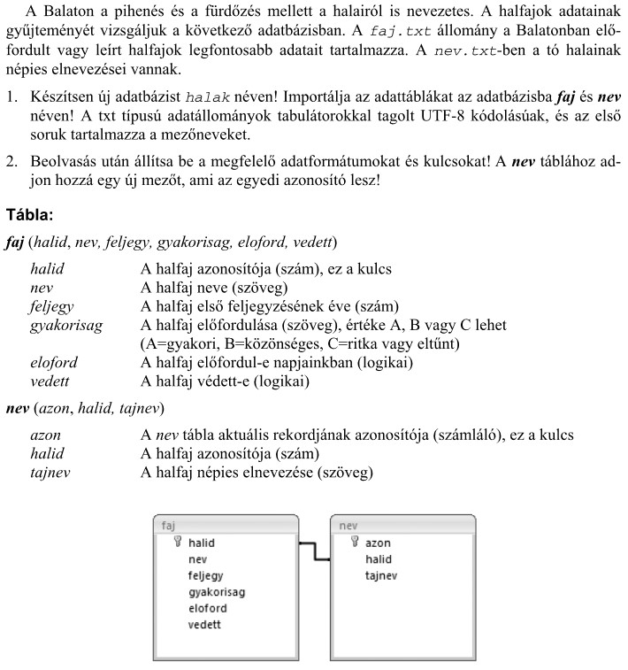

# Kazai Bence
Projekt elnevezése: film
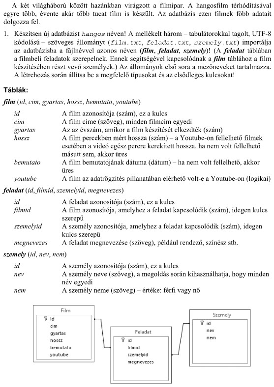

# Nagy Gábor Mihály
Projekt elnevezése: sportverseny
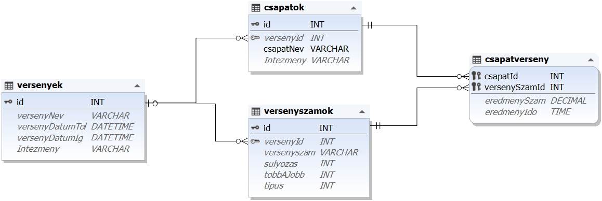

# Nagy Gergő
Projekt elnevezése: kollokvium
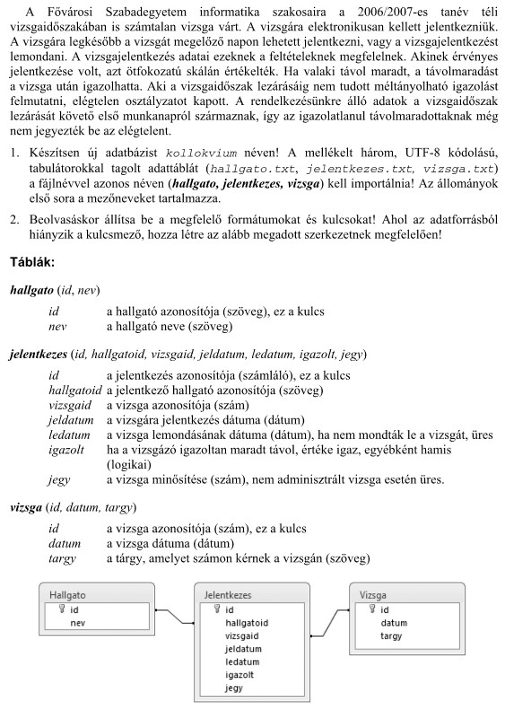

# Pisák Dániel
Projekt elnevezése: kolcsonzes
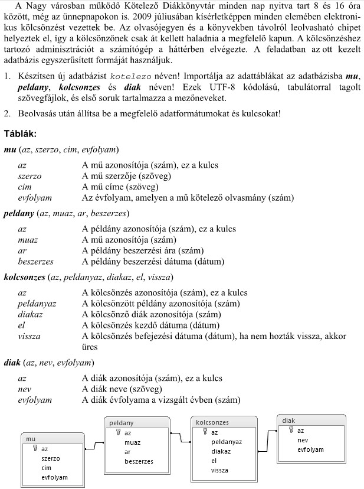

# Rézműves Márk
Projekt elnevezése: pizza
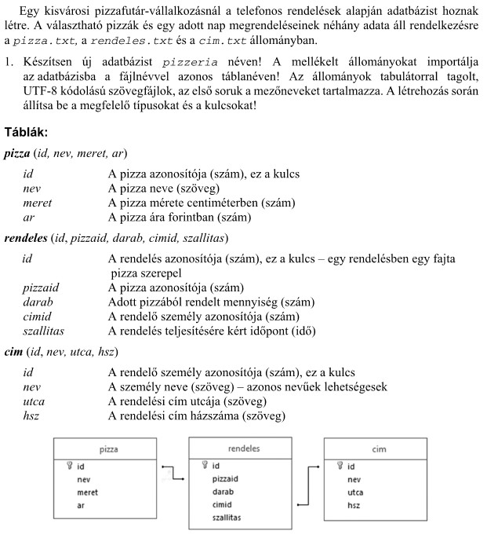

# Sulyok István
Projekt elnevezése: recept
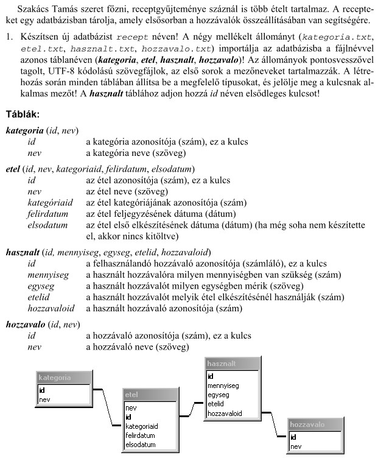

# Szabó Krisztián
Projekt elnevezése: szamlazo
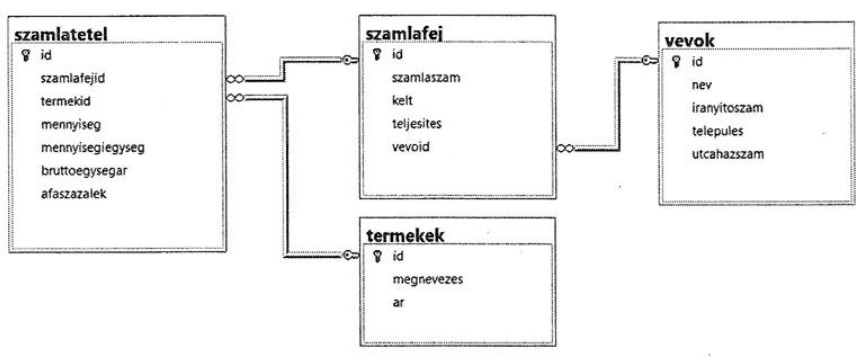

# Szabó Levente
Projekt elnevezése: webaruhazRuha

# Szilágyi Brendon Dominik 
Projekt elnevezése: autokolcsonzo
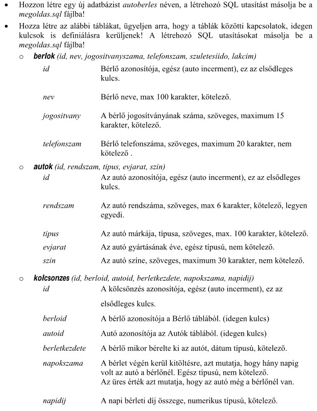

